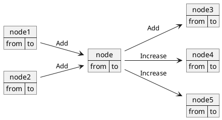

感觉不用UML来解释自己的程序还是太难说清楚了，所以我在Rider里装了一个PlantUML的插件，简单学了一下用法。

下面是大概效果：

```puml
@startuml
left to right direction
map node1{
 from => to
}
map node2{
 from => to
}
map node{
from => to
}
node1::to --> node : Add
node2::to --> node : Add
map node3{
 from => to
}
map node4{
 from => to
}
map node5{
 from => to
}
node::to --> node3 : Add
node::to --> node4 : Increase
node::to --> node5 : Increase
@enduml

```

```puml
@startuml
left to right direction
map node1{
 from => to
}
map node2{
 from => to
}
map node{
from => to
}
node1::to --> node : Add
node2::to --> node : Add
map node3{
 from => to
}
map node4{
 from => to
}
map node5{
 from => to
}
node::to --> node3 : Add
node::to --> node4 : Increase
node::to --> node5 : Increase
@enduml
```

感觉还是比较好用的。

更多的用法要去看官网[plantuml](https://plantuml.com/zh/)

